# 21173079 김소휘

## 2주차 과제 (2022-03-15)
- 안드로이드 스튜디오 설치 && 깃허브, 가입 및 저장소 생성

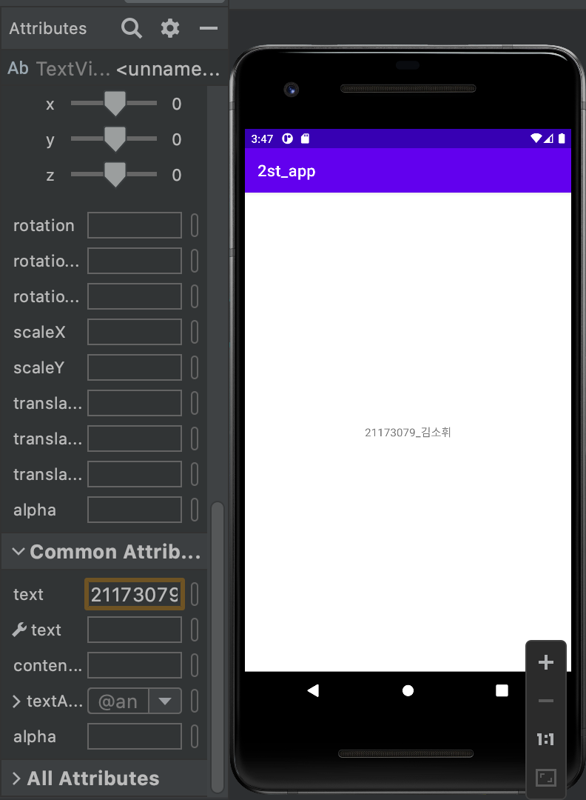</img>

## 3주차 과제 (2022-03-22)

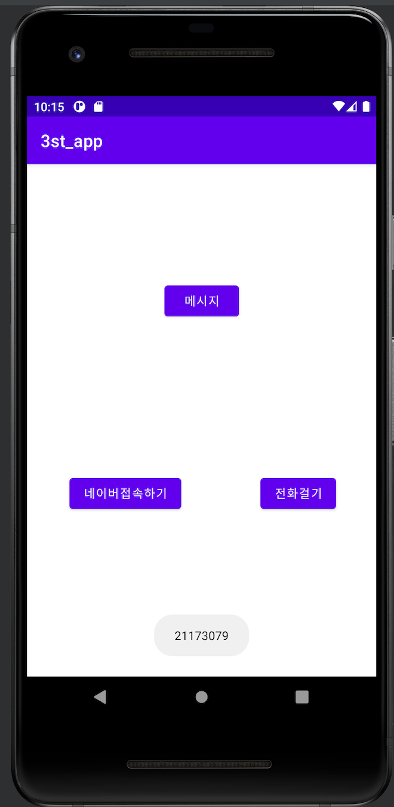</img>
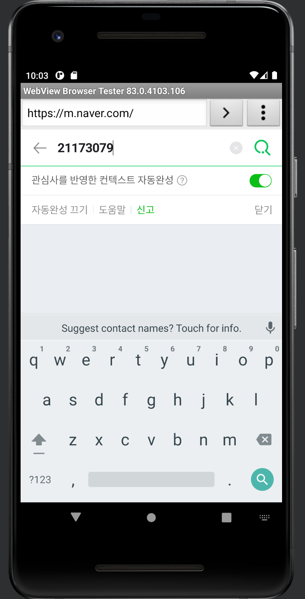</img>
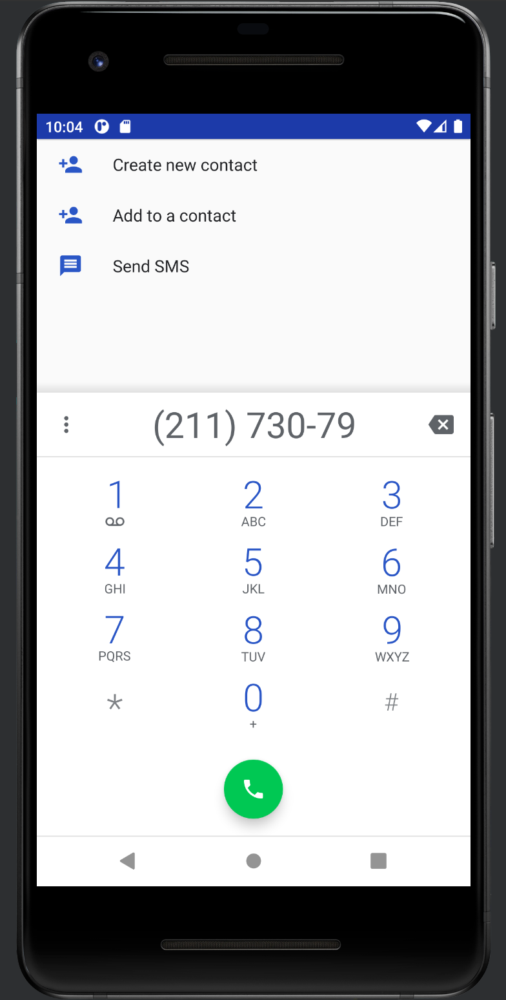</img>

## 5주차 과제 (2022-04-05)

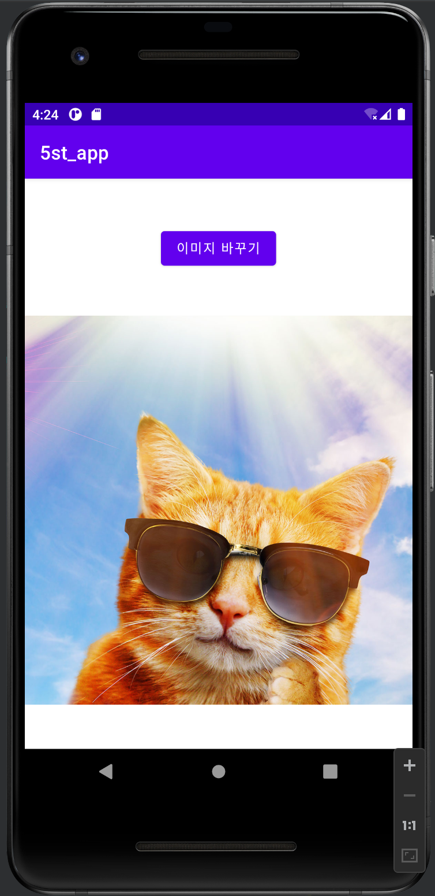</img>
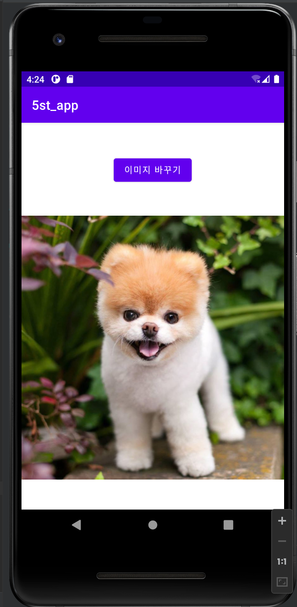</img>
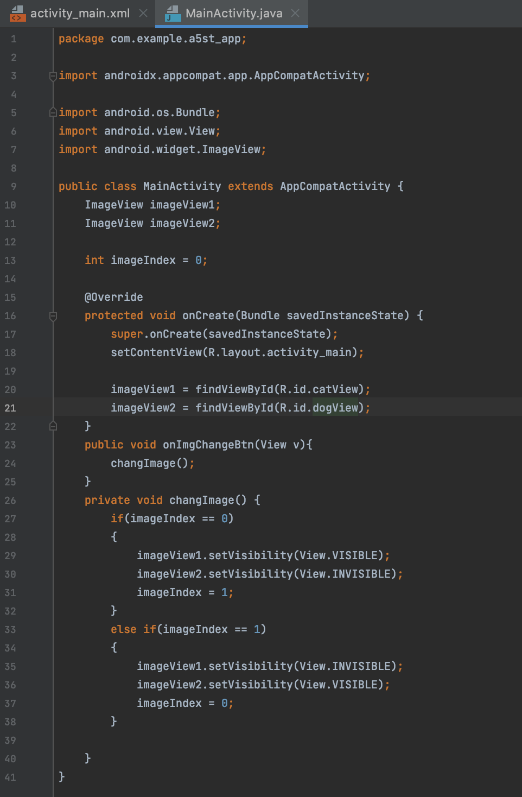</img>
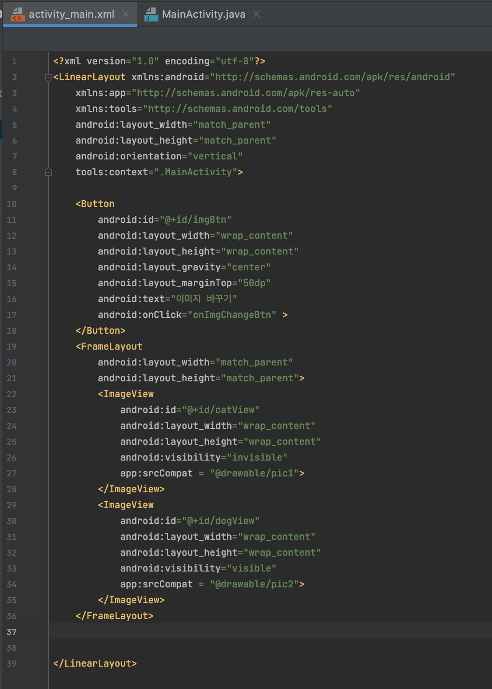</img>

## 6주차 과제 (2022-04-12)
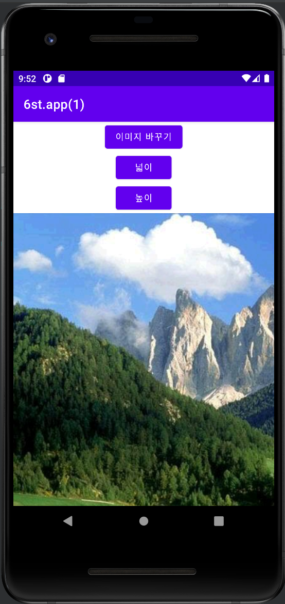</img>
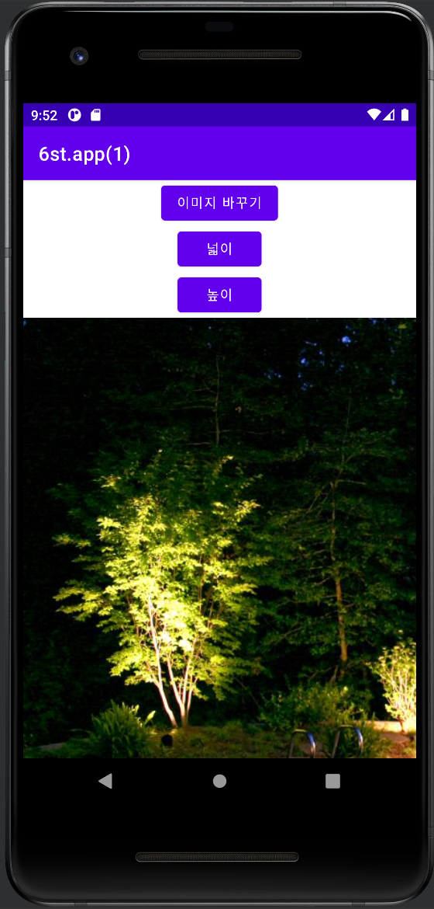</img>
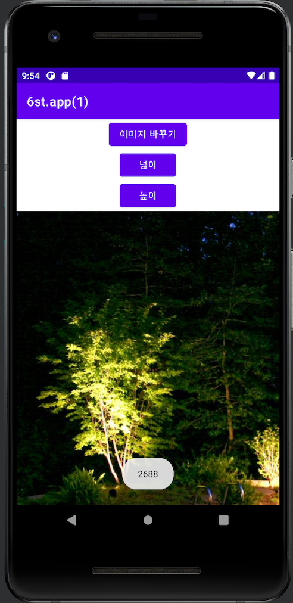</img>
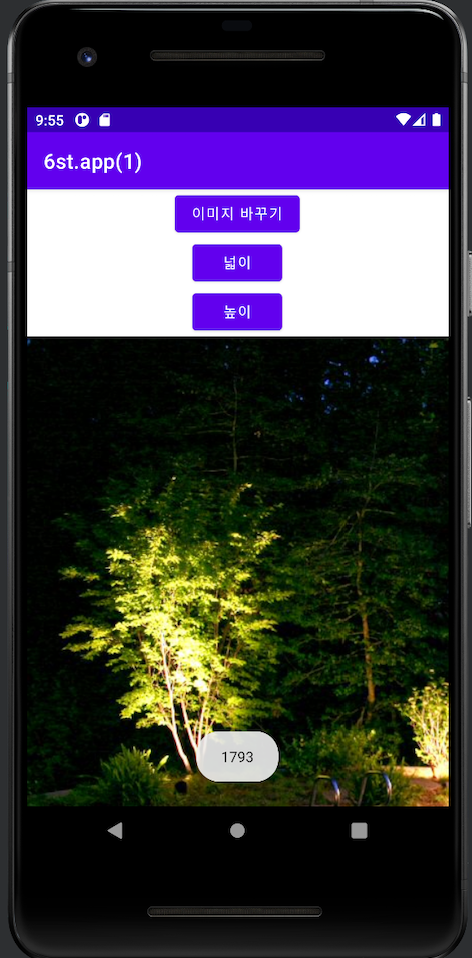</img>

## 10주차 과제 (2022-05-10)
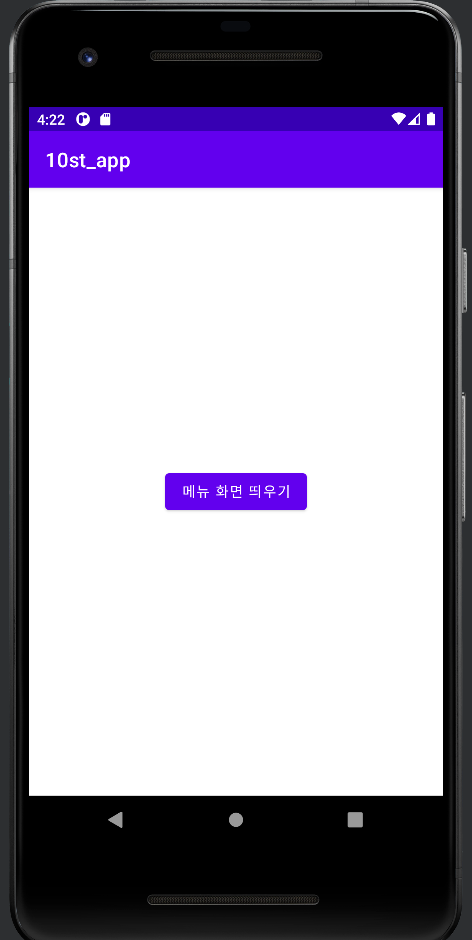</img>
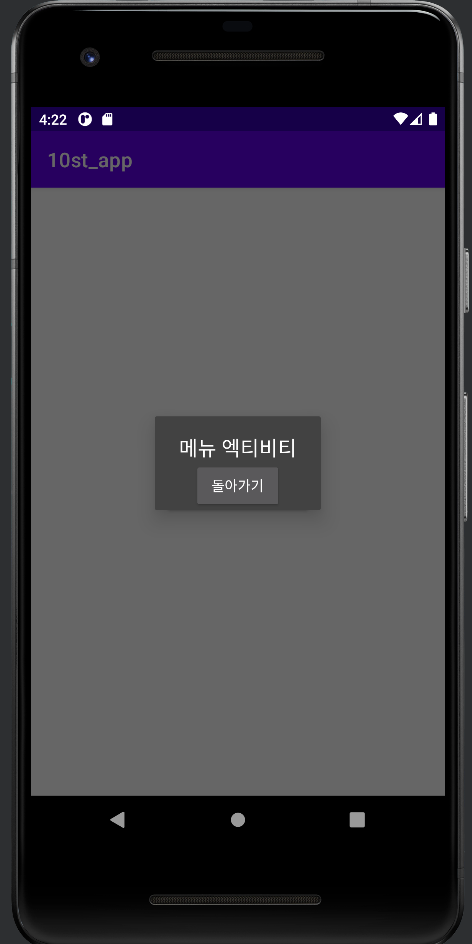</img>
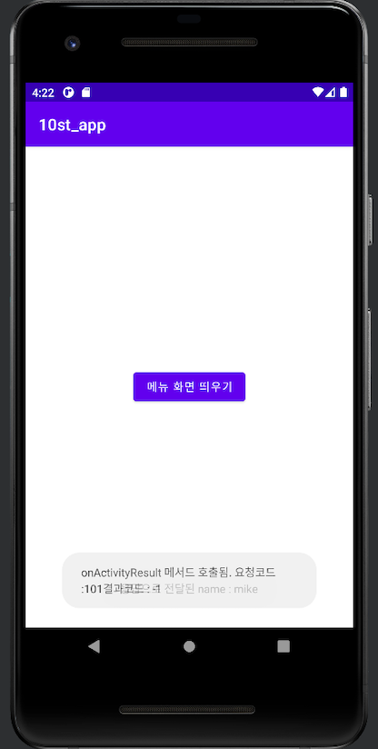</img>
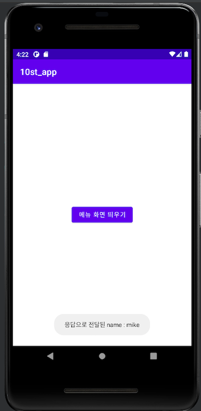</img>

## 11주차 과제 (2022-05-17)
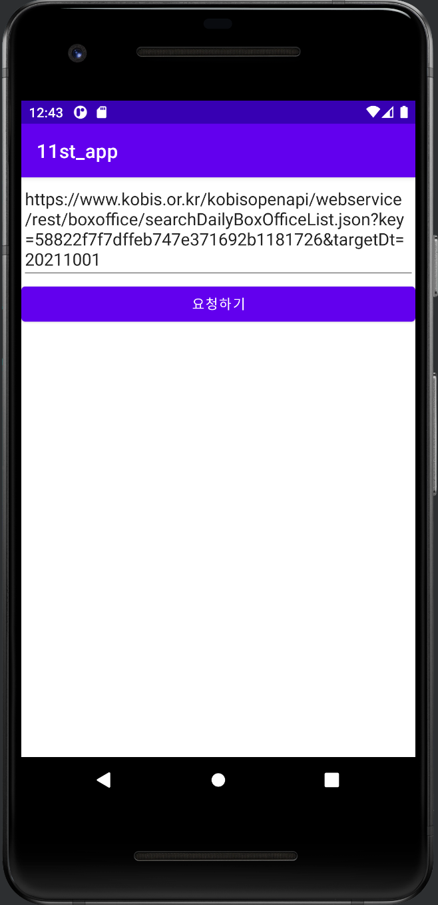</img>
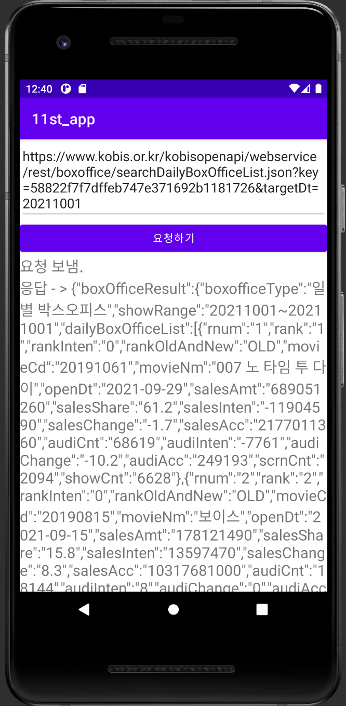</img>
